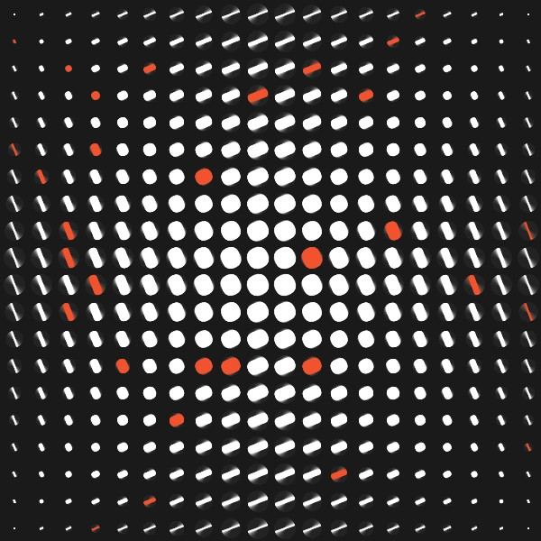

# CreativeCoding

## Tag 2

###### Sketch zur Exercise Algorithmic Thinking

Algorithmus füllt Zellen eines zufälligen Gitters mit runden Rechtecken, die mit zufällig zugewiesener Farbe blinken und rotieren

